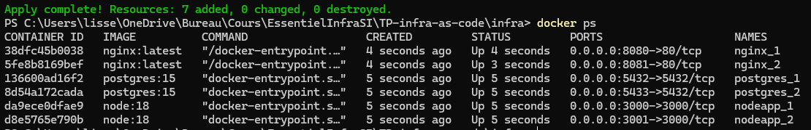
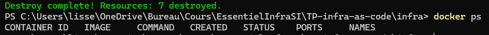
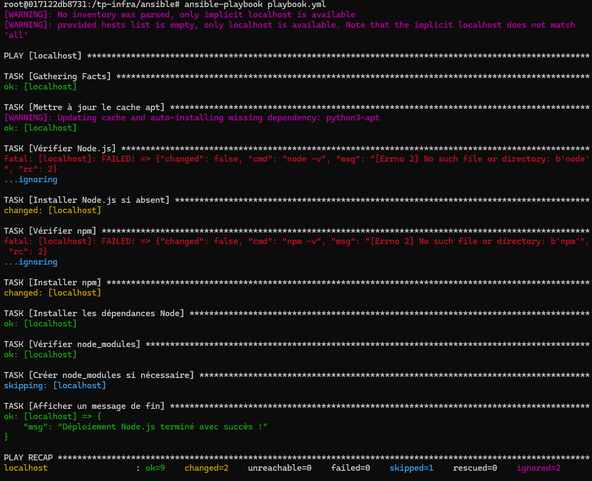
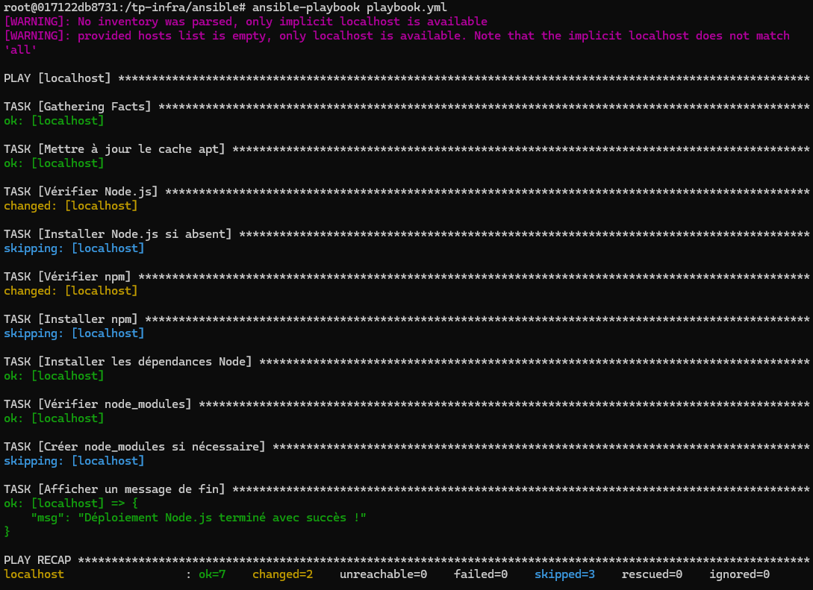
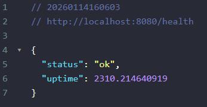

# TP Infrastructure as Code - WebSolutions Inc.

## 1 - Présentation Générale

Ce projet a pour objectif d'automatiser le déploiement et la gestion
d'une infrastructure web complète en utilisant les principes de **l'Infrastructure as Code**.

L'infrastructure permet de déployer : 
- Un serveur web **Nginx** 
- Un serveur applicatif **Node.js (Express)** 
- Une base de données **PostgreSQL** 
- Un pipeline **CI/CD** pour automatiser les tests

Les outils utilisés : 
- **OpenTofu** (Infrastructure as Code) 
- **Docker** (conteneurisation) 
- **Ansible** (configuration) 
- **GitHub Actions** (CI/CD)

------------------------------------------------------------------------

## 2 - Architecture du Projet

### Vue d'ensemble

    Client
      ↓
    Nginx (Reverse Proxy)
      ↓
    Node.js (API)
      ↓
    PostgreSQL

### Arborescence du projet
    EssentielInfraSI
    |    TP-infra-as-code/
    |    ├── app/
    |    |   |──test/
    |    |   |    |──app.test.js
    |    │   ├── index.js
    |    │   ├── package.json
    |    │   └── node_modules/
    |    ├── nginx/
    |    │   └── default.conf
    |    ├── ansible/
    |    │   └── playbook.yml
    |    |   └── hosts.ini
    |    ├── infra/
    |        └── main.tf
    └── .github/
        └── workflows/
            └── ci-cd.yml

------------------------------------------------------------------------

## 3 - Infrastructure avec OpenTofu

### Rôle d'OpenTofu

OpenTofu permet de décrire l'infrastructure sous forme de code afin de: 
- Automatiser la création des ressources 
- Garantir la reproductibilité 
- Versionner l'infrastructure

### Ressources provisionnées

Le fichier `main.tf` permet de créer : 
- Un réseau Docker dédié 
- Un ou plusieurs serveur PostgreSQL
- Un ou plusieurs serveurs Node.js
- Un ou plusieurs serveurs Nginx

### Commandes d'utilisation

``` bash
tofu init
tofu plan
tofu apply
```
Vérification avec un ```docker ps```



Pour supprimer l'infrastructure :

``` bash
tofu destroy
```



------------------------------------------------------------------------

## 4 - Configuration avec Ansible

### Rôle d'Ansible

Ansible est utilisé pour : 
- Installer Node.js et npm 
- Installer les dépendances de l'application 

### Idempotence

Le playbook Ansible est idempotent et peut être exécuté plusieurs fois
sans provoquer de modifications inutiles.

### Installation d'Ansible et exécution du playbook

``` bash
# Lancement d'un conteneur Ubuntu et installation d'Ansible
docker run -it --rm -v "${PWD}:/tp-infra" ubuntu:22.04 bash
apt update
apt install -y ansible curl

cd ansible
ansible-playbook playbook.yml
```
Lors du premier lancement node.js et npm n'existe pas, l'installation va se faire



Si on le lance une deuxième fois npm et node seront détectés, l'installation ne va pas se faire



Note: il y a quand même 2 changement signalés car Ansible considère les commanndes ```npm -v``` et ```node -v``` comme une "modification"

------------------------------------------------------------------------

## 5 - Application Node.js

### Description

L'application Node.js est basée sur **Express** et expose un endpoint de
santé :

    GET /health

Réponse attendue :

``` json
{
  "status": "ok"
}
```

------------------------------------------------------------------------

## 6 - Serveur Web Nginx

### Rôle de Nginx

Nginx agit comme : 
- Serveur web 
- Reverse proxy vers les serveurs Node.js

### Configuration

Le fichier `nginx/default.conf` permet de rediriger les requêtes HTTP vers les serveurs applicatifs internes.

localhost:8080/health



------------------------------------------------------------------------

## 7 - Pipeline CI/CD avec GitHub Actions

### Objectif

Le pipeline CI/CD automatise : 
- L'installation des dépendances 
- L'exécution des tests - La vérification de l'endpoint `/health`

### Déclenchement

Le pipeline est déclenché automatiquement à chaque **push sur la branche
`main`**.

------------------------------------------------------------------------

## 8 - Bonnes Pratiques Appliquées

-   Infrastructure versionnée
-   Séparation infrastructure / configuration
-   Scripts idempotents
-   Ports configurables
-   Tests automatisés
-   CI/CD reproductible

------------------------------------------------------------------------

## 9 - Rapport d’Analyse : Défis, Solutions et Améliorations Futures

### Défis rencontrés

Au cours de la réalisation de ce projet, plusieurs défis techniques ont été rencontrés :

- **Ordre de démarrage des services** : certains services, comme Nginx, démarraient avant les serveurs applicatifs Node.js, ce qui entraînait des erreurs de connexion.
- **Résolution DNS interne Docker** : Nginx ne parvenait pas à résoudre les noms des conteneurs Node.js en raison d’une incohérence dans le nommage.
- **Idempotence des scripts Ansible** : certaines tâches provoquaient des changements à chaque exécution, ce qui allait à l’encontre des bonnes pratiques DevOps.

---

### Solutions adoptées

Pour répondre à ces problématiques, plusieurs solutions ont été mises en place :

- **Dépendances explicites dans OpenTofu** : l’ajout de `depends_on` a garanti un ordre de démarrage cohérent entre les conteneurs.
- **Nommage cohérent des services** : les noms des conteneurs Docker ont été alignés avec les configurations Nginx pour assurer une résolution DNS correcte.
- **Playbooks Ansible idempotents** : les tâches ont été revues afin d’éviter les changements inutiles lors des exécutions répétées.

---

### Améliorations futures envisageables

Plusieurs axes d’amélioration peuvent être envisagés pour faire évoluer ce projet :

- Gestion sécurisée des secrets (mots de passe, clés) via des outils comme **Vault** ou les **secrets GitHub**.
- Migration vers un orchestrateur de conteneurs comme **Kubernetes** pour automatiser la gestion de conteneurs.

---

## 10 - Conclusion

Ce projet démontre l'intérêt des pratiques de **l'Infrastructure as Code** pour déployer des environnements fiables, reproductibles et automatisés.