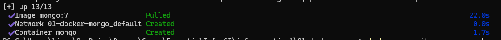
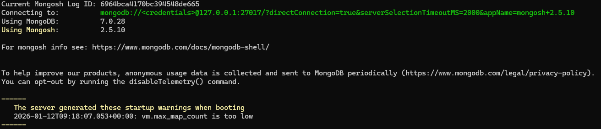

# Installation de MongoDB avec Docker et l'image

1. ```docker compose up -d```



2. vérifier l'installation en accèdant au shell Mongo ``` docker exec -it mongo mongosh -u root -p example```



3. Création d'un utilisateur

