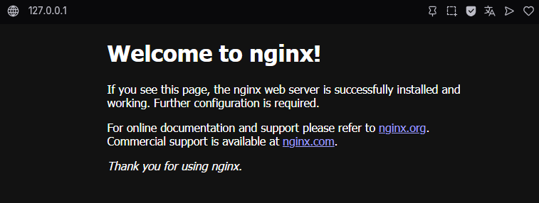
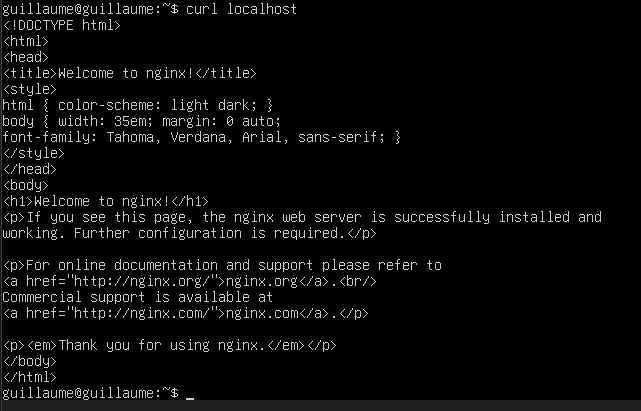
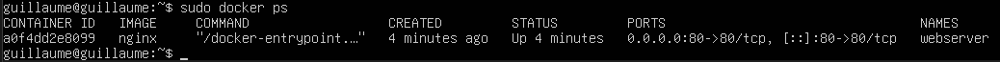
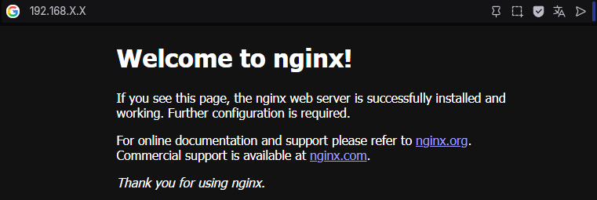

# Lancement du conteneur docker
création d'un conteneur en utilisant nginx avec la commande ``` sudo docker run --name webserver -d -p 80:80 nginx``` 
1. Sur Windows

 

2. sur la Ubuntu Server  
sur un navigateur:



dans la vm:



## vérification que le conteneur tourne
avec ```sudo docker ps```



## Test avec le PC hôte
1. configuation du réseau de la VM passant du type NAT à Accès par pont  
2. Test avec l'adresse IP 192.168.x.x

