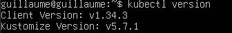
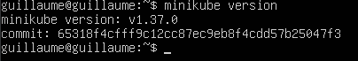
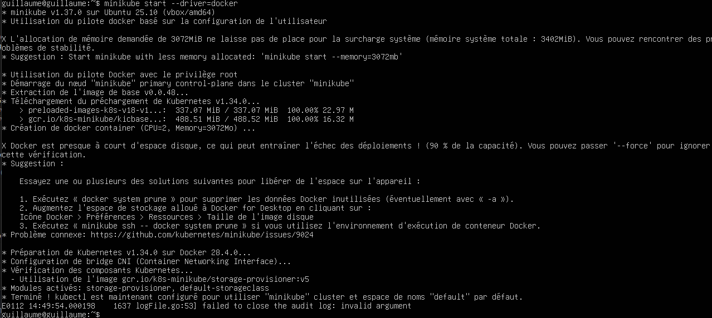
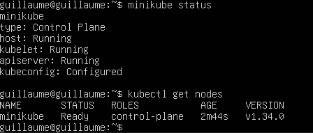
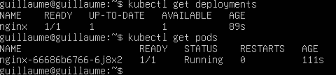
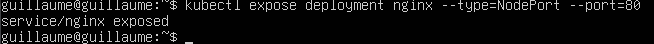
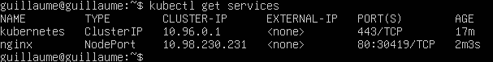
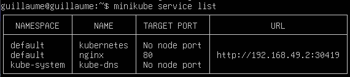
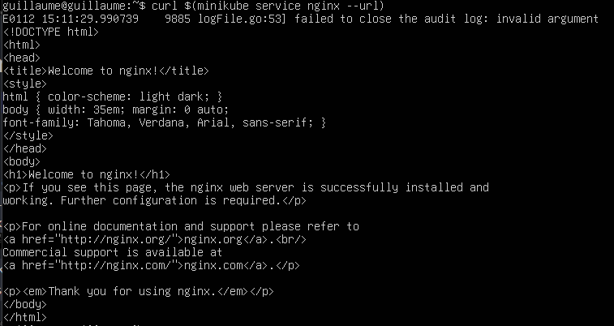
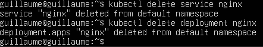

# Minikube et kubectl
## Installation
- Pour Kubectl
    - ```sudo apt install -y snapd```
    - ```sudo snap install kubectl --classic```
    - Vérification avec ```kubectl version```  

    

- Pour Minikube
    - ```sudo mv minikube-linux-amd64 /usr/local/bin/minikube```  
    - Vérification avec ```minikube version```

    

# Démarrage
- On démarre minikube avec ```minikube start --driver=docker```  


- Vérification de l'état de minikube et kubectl
    - ```minikube status``` et ```kubectl get nodes```  

    

# Déploiement d'une application Nginx
- Déploiement avec ```kubectl create deployment nginx --image=nginx```  


- Vérification ```kubectl get deployments``` et ```kubectl get pods```  



# Exposition de l'application
- Exposer l'application a l'extérieur du cluster avec la commande ```kubectl expose deployment nginx --type=NodePort --port=80```  


- Vérification ```kubectl get services``` 


- Récupérer l'URL ```minikube service nginx --url``` ou ```minikube service list```


- Tester depuis la VM ```curl $(minikube service nginx --url)```



# Nettoyage (Suppression des ressources Nginx)
- Suppression avec ```kubectl delete service nginx``` et ```kubectl delete deployment nginx```

