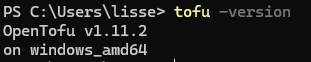
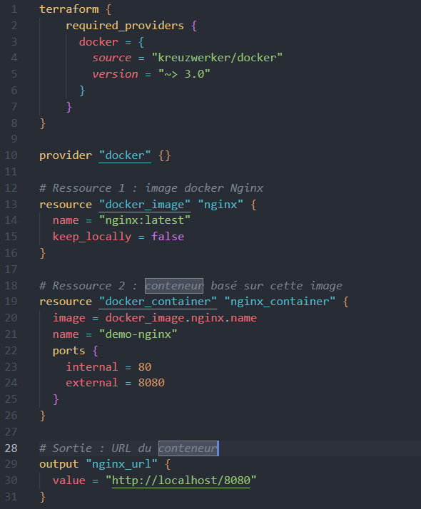
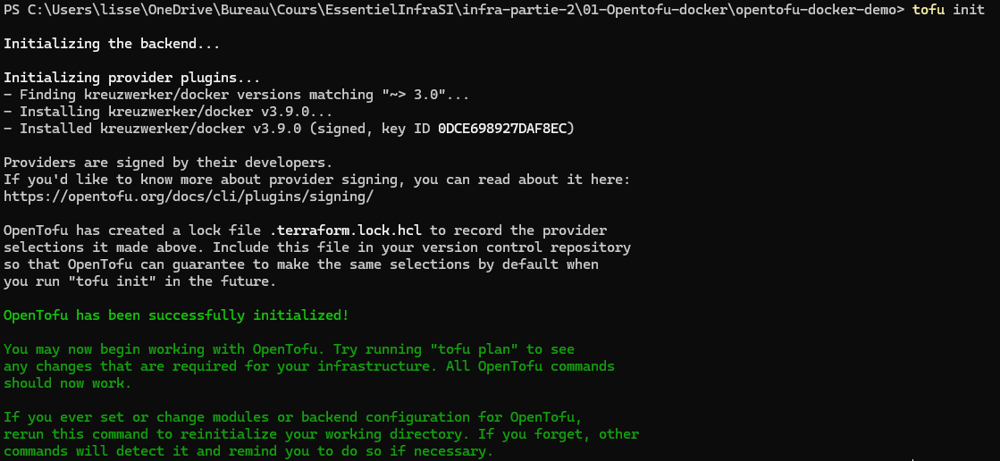
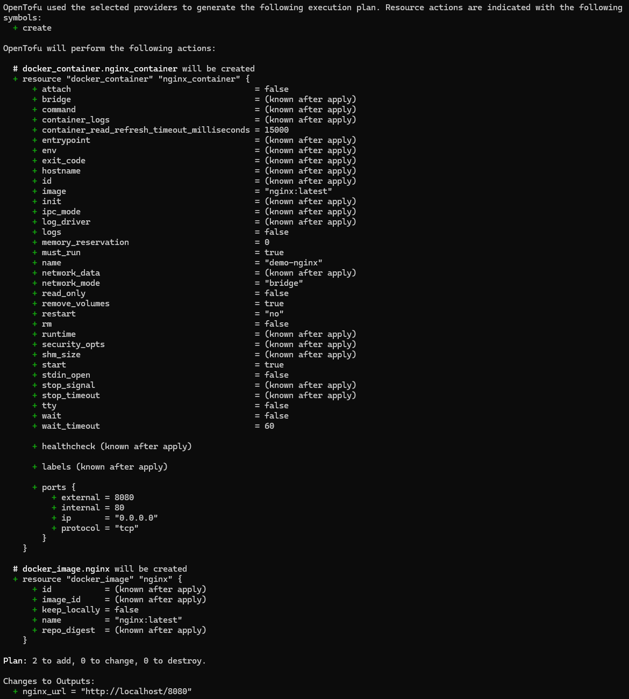
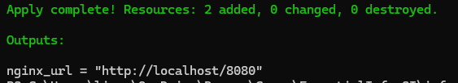
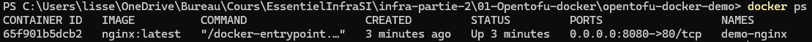
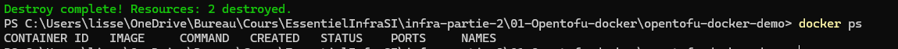

# OpenTofu
## Installation sur windows
- Installation avec ```winget install --exact --id=OpenTofu.Tofu```
- Vérification ```tofu -version```



## Création du projet
- créer le fichier ```main.tf``` avec le contenu suivant:



## Initialisation du projet
- télécharger le provider docker ```tofu init```



- Simuler la création et lancement du déploiement ```tofu plan``` et ```tofu apply -auto-approve```





- Vérification avec ```docker ps```



- Détruire l’infrastructure ```tofu destroy -auto-approve```

