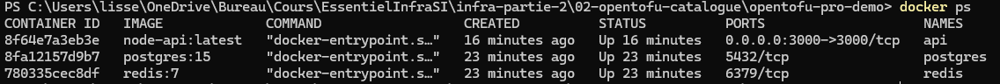
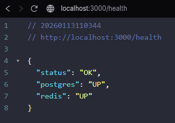
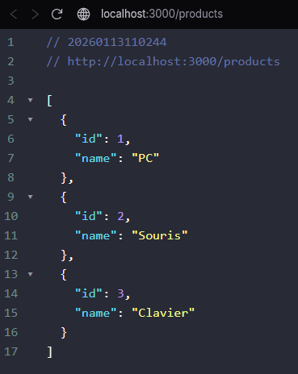

# Opentofu catalogue API
## Mise en place du projet
- configuration de l'infrastructure
    - réseau docker 
    - Volumes pour PostgreSQL et Redis
    - Trois conteneurs pour Redis, PostgreSQL et l'API (image docker pour l'API)  

- Création des variables ex: pour le port de l'API

```
variable "api_port" {
    description = "Port exposé pour l’API"
    type = number
    default = 3000
}
```
- création de l'API avec 
    - un endpoint ``` /health ``` permettant de contrôle si l'application fonctionne correctement (API, PostgreSQL, Redis)
    - un endpoint ```/products``` permettant de retourner les données 

- initialisation des variables avec le fichier ```terraform.tfvars```

- Initialisation du projet
    - ```tofu init```
    - ```tofu plan```
    - ```tofu apply -auto-approve```

- Vérification avec ```docker ps```



- Test sur le navigateur 
    - Vérification si l'application fonctionne correctement (API, PostgreSQL et Redis) ``` http://localhost:3000/health ```

    

   -  Vérifications des données ``` http://localhost:3000/products ```

   