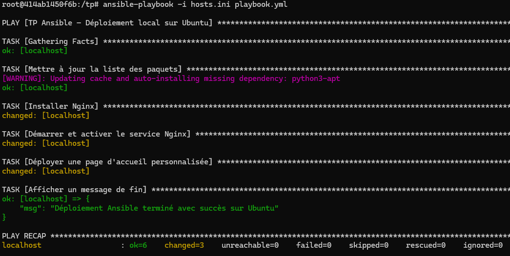
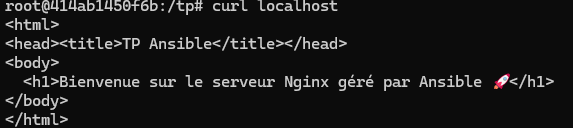
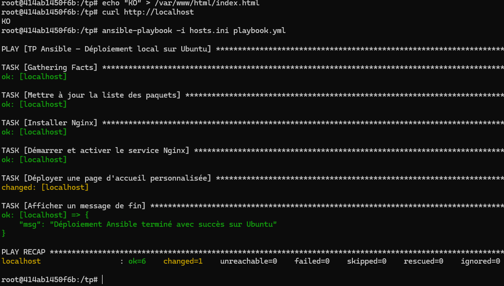
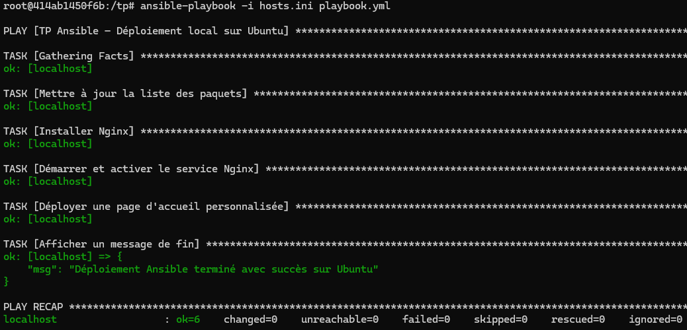

# Ansible
- Installation de Ansible
- Création d'un fichier inventaire en local sous le groupe ```targets```

- Test de la connexion ```ansible -i hosts.ini targets -m ping```


- Exécution du playbook ```ansible-playbook -i hosts.ini playbook.yml```



- Vérification avec ```curl localhost```



- Test de l'idempotence ```ansible-playbook -i hosts.ini playbook.yml```
    - Détection d'un changement

    

    - Relance sans modification

    