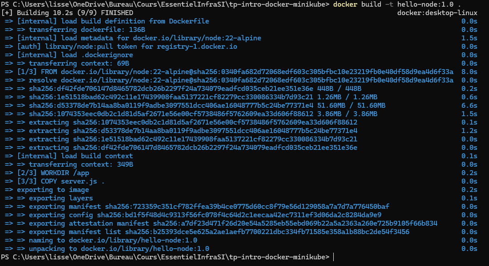
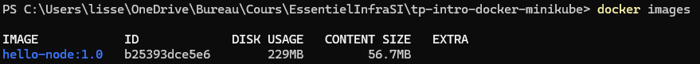
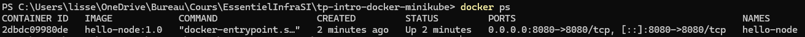
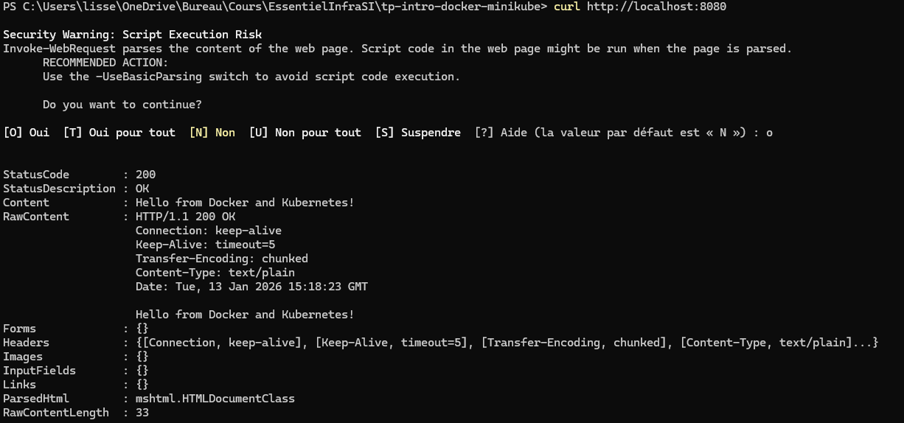

# Intro Docker Minikube

- Création des fichiers (server node.js, dockerfile)

- Build image docker ```docker build -t hello-node:1.0 .```



- Validation ```docker images```



- Lancement du conteneur ```docker run -d --name hello-node -p 8080:8080 hello-node:1.0```

- Validation ```docker ps```



```curl http://localhost:8080```



